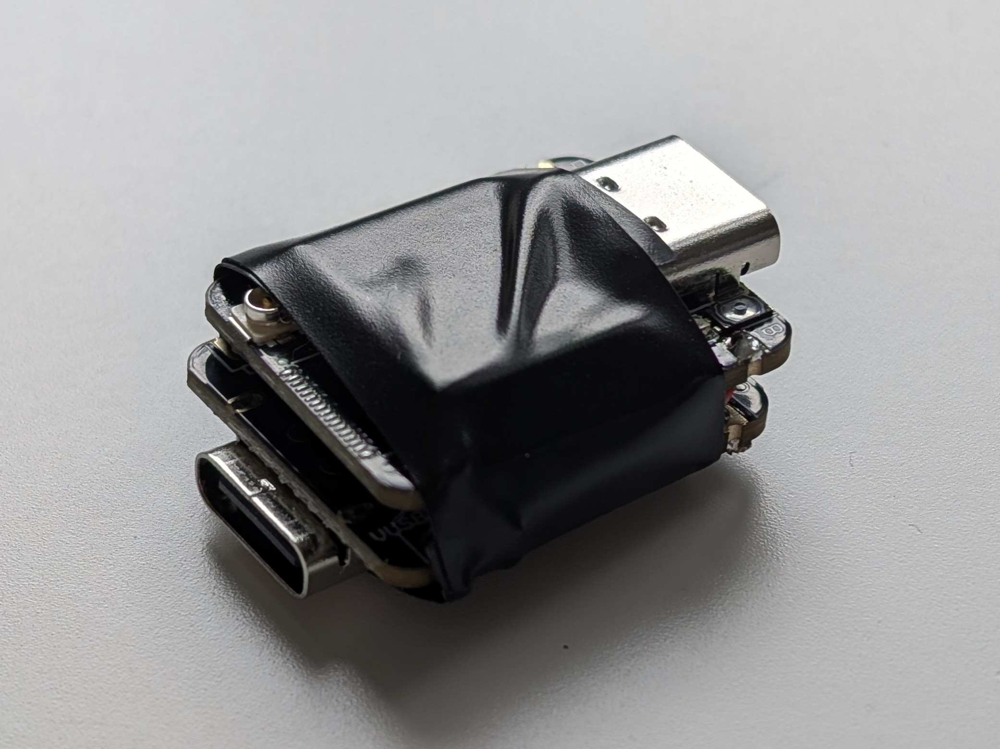

# ESP32 Keylogger

> [!NOTE]
> Work in progress, see ***[goals](#goals)***

A simple hardware keylogger written in C++

You need ***two*** `ESP32-S3`s, an `USB OTG` adapter, and thats it!

I am using the Seeed Studio XIAO ESP32-S3 for it's size and low price.

## Goals
- [x] read keys from the keyboard
- [x] send keypresses over uart to the other board
- [ ] emulate a keyboard with the second board with usb hid
- [ ] persistent storage
- [ ] save keypresses into a logfile
- [ ] usb mass storage
- [ ] config file
- [ ] rtos \*

\*maybe??

---
## brainstorming

zapis do nejakyho logu, asi rovnou s milis(), mozna do nejaky tabulky?
ale mam docela omezeny misto takze xml nebo tak to asi nebude.
k tomu by pak sel udelat parser kterej to hezky zobrazi uzivateli.

extra: pokud se pripoji k wifi a k internetu tak muzu mit RTC

bude existovat nejakej config file, nejspis v .config.
pokud nebude existovat tak se automaticky vytvori s default values

tam asi pujde vybrat styl ukladani (simple, detailed), mozna jak se ma aktivovat MSD mode a pripadne ta wifi

a rozlozeni klavesnice, i kdyz to by bylo lepsi az u toho parseru, protoze to zrovna dela OS. ale dalo by se to vyuzit kdybych z toho udelal rubber ducky kombo
